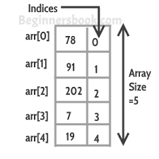

# Arrays
A code explaining the basics of Arrays in cpp programming language
## Theory
In Cpp, an array is a data structure that is used to store multiple values of similar data types in a contiguous memory location.
</br>
The diagrammatic representaion of an array is:</br>


Some Properties of Arrays in C++:
- Indexing of an array starts from 0. It means the first element is stored at the 0, the second at 1st, and so on.
- Elements of an array can be accessed using their indices.
- Once an array is declared its size remains constant throughout the program.
- An array can have multiple dimensions.
- The number of elements in an array can be determined using the sizeof operator.
- We can find the size of the type of elements stored in an array by subtracting adjacent addresses.
### Declaration of Arrays
We can declare an array by simply specifying the data type first and then the name of an array with its size. The syntax is:
</br>
```data_type variable_name[integer_sizer_of_array];```
</br>
Example:
</br>
```int keshav[5];```
### Initialization of arrays
In Cpp, there are a lot of ways to initialize arrays. Some Common ways to initialize arrays are:
1. Initialize arrays with values and specified size. Example </br>
```int keshav[5]={0,1,2,3,4};```
2. Initialize arrays values, without specified values. Example </br>
```int keshav[]={0,1,2,3,4};```
3. Initialize arrays after declaration. Using loops. Example </br>
```
    //Declaration
    int keshav[5];
    //Initialization
    for(int i=0;i<N;i++)
    {
        keshav[i]=value;
    }
```
### Accesing elements of the array
IN Cpp we can access elements of an array directly or using loops. Example:
1. Directly
   ```cout<<keshav[1];```
2. Using loops
   ```
   for(int i=0;i<N;i++)
   {
     cout<<keshav[i];
   }
   ```
## Outcome of the code
We try to use array to do some simple tasks like;
1. Print the full array
2. Find the biggest and the smallest number
3. Find the peak Values. (Peak vales are values in arrays that are bigger than the values int the indexes before and after them.)
4. Search for numbers in the arrays
## Explainantion
1. To print the full array </br>
   We use a for loop to print all the elements of the array
2. To print the biggest and the smallest value</br>
   We again use a for loop that runs N times (N=number of elemensts) and use an if statement to find the biggest or smallewst number.
3. To Find peak vales</br>
   We use another for loop and find the peak vales by comparing an the values of an array with an index before and after the value.
4. To search for numbers</br>
   We use another for loop and compare balues until we fin d the required value, if not we print that the vales are not found.
## Output Screenshot

   
